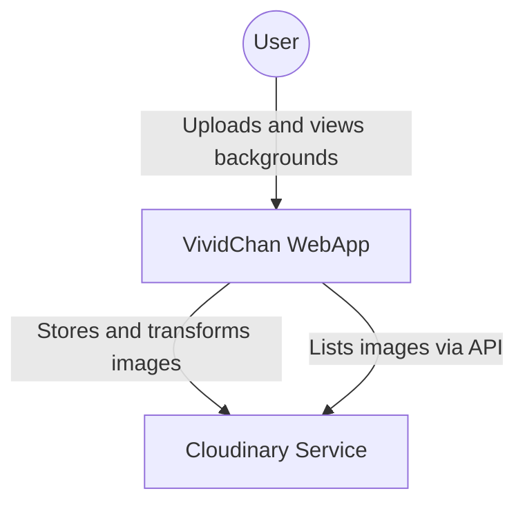
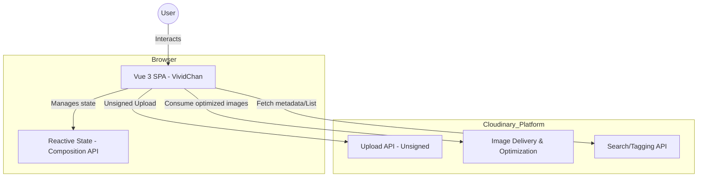

# VividChan Technical Specifications

## 1. Project Overview
**VividChan** is a high-aesthetics "Cyber-Anime" styled web application for uploading and viewing wallpapers/backgrounds. It is built as a serverless SPA (Single Page Application) leveraging Cloudinary for all media management.

## 2. Architecture (C4 Model)

### Level 1: System Context
The user interacts with the VividChan WebApp to manage backgrounds. The system delegates storage, transformation, and retrieval to Cloudinary.

### Level 2: Containers
The application is a Vue 3 SPA running in the user's browser.

## 3. Data Strategy
Since there is no dedicated backend, we use Cloudinary as our primary data store:
- **Upload**: Images are uploaded with a fixed tag `vividchan_gallery`.
- **Retrieval**: The app fetches the list of resources associated with the `vividchan_gallery` tag.

## 4. Image Optimization & Async Strategy
To ensure maximum performance and a "fluid" feel, we implement the following:
- **Automatic Optimization**: All images are served with `f_auto` (format) and `q_auto` (quality).
- **Responsive Delivery**: Using the `@cloudinary/vue` responsive plugin to request images sized exactly for the container.
- **Eager Transformations (Async)**: During upload, we request common transformations (e.g., gallery thumbnails) using the `eager` parameter. This ensures transformations are pre-computed on Cloudinary servers before any user requests them.
- **Lazy Loading & Placeholders**: All gallery images use the `lazyload()` plugin and a blurred placeholder for seamless UX.

## 5. Design System (Anime Cybercore)
- **Primary Color**: `#0D0D0D` (Deep Space)
- **Accent 1**: `#FF007A` (Neon Pink)
- **Accent 2**: `#00F0FF` (Electric Cyan)
- **Layout**: Bento Grid for the gallery.
- **Typography**: Heavy Sans-serif (e.g., Inter/Roboto) mixed with stylized Japanese glyphs for decoration.

## 5. Technical Stack
- **Framework**: Vue 3 (Vite)
- **Styling**: Tailwind CSS
- **Media**: Cloudinary SDK (@cloudinary/url-gen, @cloudinary/vue)
- **HTTP Client**: Native Fetch API
- **Type Safety**: TypeScript
