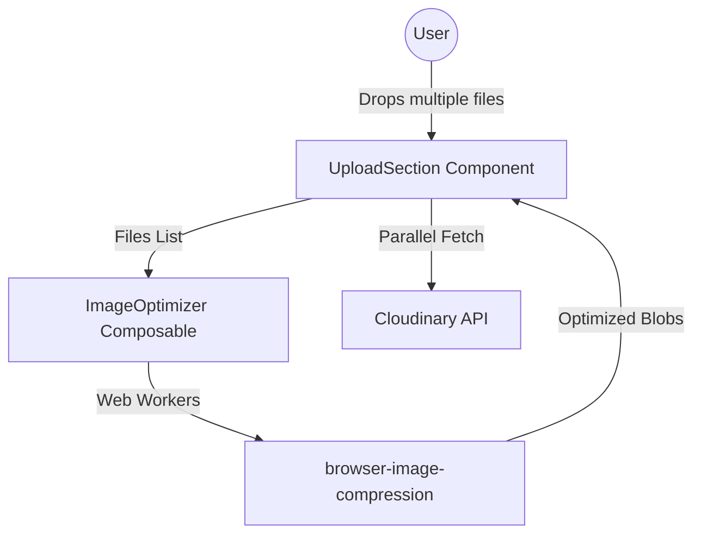

# VividChan Technical Specifications - Image Optimization & Batch Upload

## 1. Project Overview
**VividChan** is evolving to support batch image uploads with high-performance client-side pre-optimization. This ensures minimal bandwidth usage and faster upload times while maintaining high visual quality.

## 2. Updated Architecture (Batch Context)

### Parallel Processing
The system will now process multiple files in parallel using Web Workers for compression to avoid UI blocking.

## 3. Client-Side Optimization Strategy
To reduce the 10MB original limit burden and speed up the experience:
- **Library**: `browser-image-compression` (Web Worker support).
- **Target Format**: WebP (native conversion for all modern browsers).
- **Compression Settings**:
  - Max Size: 2MB (post-optimization).
  - Max Width/Height: 3840px (4K resolution preserved).
  - Quality: 0.85 (balanced for "Aesthetic" wallpapers).
- **Parallelism**: Process up to 4 images simultaneously to balance speed and CPU usage.

## 4. Batch Upload UI/UX
- **Multi-Selection**: `<input type="file" multiple />` support.
- **Queue Management**:
  - Individual progress indicators for each file.
  - States: `Pending`, `Compressing`, `Uploading`, `Complete`, `Error`.
- **Feedback**: Neon-styled toast notifications for overall batch status.

## 5. Technical Stack Additions
- **Optimization**: `browser-image-compression`
- **Concurrency**: Native `Promise.all` with limited concurrency patterns.
- **State Management**: Reactive array of upload status objects.

## 6. Security Refinement
- **Frontend Validation**: Still strictly enforcing JPG, PNG, WEBP, GIF.
- **Client-Side Sanitization**: Compression process naturally strips unnecessary metadata/EXIF if configured.
